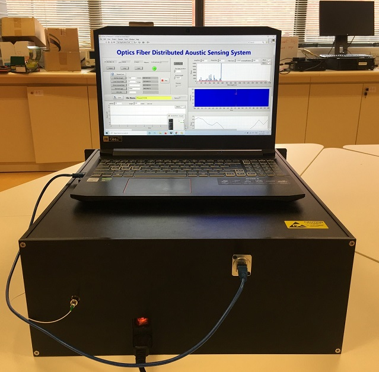

### Biography
Dr. Huan WU received the B.Eng degree from the Nanjing University of Aeronautics and Astronautics in 2013 and Ph.D. degree from the Chinese Univeristy of Hong Kong in 2018, respectively. She was a post-doc research fellow in Department of Electronic and Information Engineering (EIE), the Hong Kong Polytechnic Univeristy (PolyU) from 2018 to 2020 and in Department of Land Surveying and Geo-Informatics (LSGI), PolyU from 2020 to 2022. She is currently a research assistant professor in EIE jointly supported by Research Institute for Land and Space (RILS) and Photonics Research Institute (PRI). Her current research interests include distributed optical fiber sensing and its applications. 

---

### Selected publications
1.	Huan Wu, Bin Zhou, Kun Zhu, Chao Shang, Hwa-Yaw Tam, and Chao Lu. "Pattern recognition in distributed fiber-optic acoustic sensor using an intensity and phase stacked convolutional neural network with data augmentation." Optics Express, 29(3), 3269-3283, 2021.
2.	Zhiyong Zhao+, Huan Wu+, Junhui Hu, Kun Zhu, Yunli Dang, Yaxi Yan, Ming Tang, Chao Lu. "Interference fading suppression in φ-OTDR using space-division multiplexed probes." Optics Express, 29(10), 15452-15462, 2021.
3.	Kun Zhu, Bin Zhou, Huan Wu*, Chao Shang, Linyue Lu, Muhammad Adeel, Yaxi Yan, Zhiyong Zhao, Hwa-Yaw Tam, and Chao Lu. "Multipath distributed acoustic sensing system based on phase-sensitive optical time-domain reflectometry with frequency division multiplexing technique." Optics and Lasers in Engineering, 142, 106593, 2021.
4.	Huan Wu, Chao Shang, Kun Zhu, Chao Lu. "Vibration detection in distributed acoustic sensor with threshold-based technique: A statistical view and analysis." Journal of Lightwave Technology 39(12), 4082-4093, 2020.
5.	Huan Wu, Hongda Wang, Chester Shu, Chiu-Sing Choy, and Chao Lu. "BOTDA fiber sensor system based on FPGA accelerated support vector regression." IEEE Transactions on Instrumentation and Measurement 69(6), 3826-3837, 2019.

---

### Projects
#### Distributed optical fiber sensing technologies
Distributed optical fiber sensors allow many points to be measured simultaneously, and it is compatible to ubiquitously deployed underground fiber system for telecommunication purpoose.
##### 1. Distributed acoustic sensing (DAS)
The working principle of DAS is based on the phase-sensitive OTDR that utilizes the interference effect of Rayleigh backscattering of different scatters within the pulse width. A DAS prototype that can realize real-time vibration sensing along 30 km optical fiber was built in our lab.

  

- we published a 10 class dataset named DAS1K, check our [project page](https://github.com/Haley122/Distributed-Acoustic-Sensor-DAS1K-Pattern-Recognition)
- we proposed an interference fading method based on space division multiplexing, check our [paper](https://opg.optica.org/oe/fulltext.cfm?uri=oe-29-10-15452&id=450754)
- we proposed a multipath DAS system based on frequency division multiplexing technology, check our [paper](https://www.sciencedirect.com/science/article/pii/S0143816621000634)

##### 2. Distributed temperature and strain sensing (DTSS)
The working principle of DTSS is based on the stimulated Brillouin scattering that utilizes the linear relationship of Brillouin frequency shift and temperature/strain. A DTSS system that can realize temperature/strain sensing along 50 km optical fiber was built in our lab.
 

- we accelerated the information extraction from Brillouin frequency shift from both algorithm and hardware perspectives, check our [paper1](https://ieeexplore.ieee.org/abstract/document/8010274) and [paper2](https://ieeexplore.ieee.org/abstract/document/8863981)
- we proposed SNR enhancement based on image denoising algorithm,check our [paper](https://opg.optica.org/oe/fulltext.cfm?uri=oe-26-5-5126&id=381815)
  
#### Application of Distributed optical fiber sensing technologies
##### DAS for water pipe leak detection
Key facts: 
- Over **2.3 billion** people currently live in water-stressed countries
- **20-30%** of the water is lost in most countries due to leakage
- Hong Kong loses about **15%** of water in mains, over 155 million 𝑚3 annually
- Hong long launched Replacement and Rehabilitation Programme of Water Mains (R&R programme) to replace 3,000 kilometres of aged water mains with HK$23.6 billion budget from 2000

Our work: Distributed vibration measurements along a 40-meter-long recirculating water pipe by leveraging the sensing capability of a standard outdoor fiber-optic cable are presented to prove the concept. A leak identification algorithm based on 3D convolutional neural networks (3D-CNNs) that jointly utilize temporal, spectral, and spatial information is proposed. It can detect leak flow rate as low as 0.027 L/s with a location accuracy of within 3 meters and quantification accuracy of over 85%.

